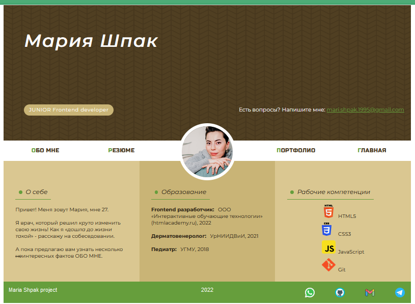
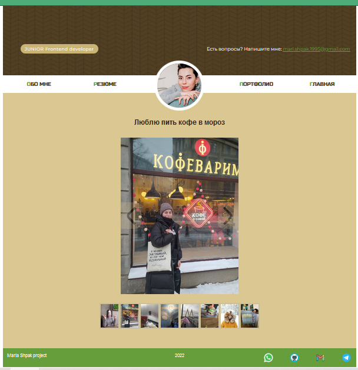
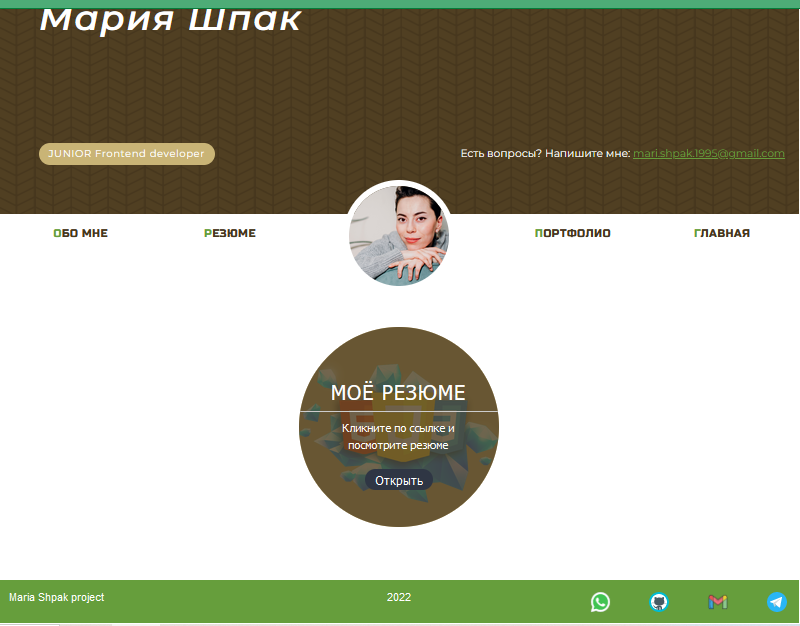
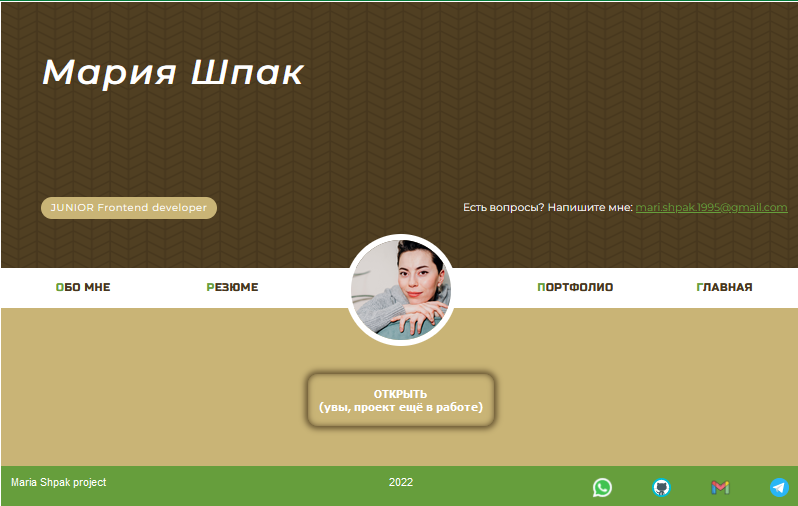

Pet-проект "Личный сайт". Стек технологий: HTML, CSS, JavaScript. Адаптивная вёрстка, реализация разных возможностей css (grid, flex, немного css-анимации), слайдер и навигация на JavaScript.
Автор: Шпак Мария.

Прилагаю скриншоты сайта:

